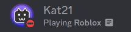
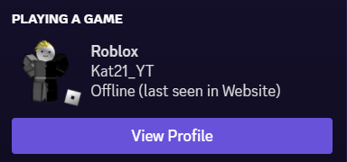
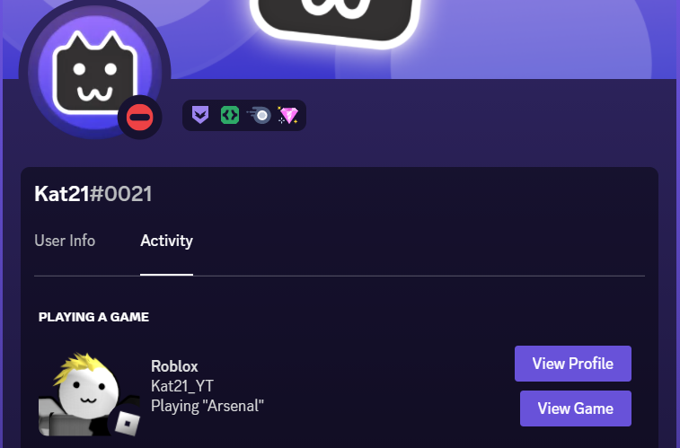

# Roblox Discord Rich Presence

Shows the game you're playing inside Roblox.

## Preview

Member list



User popout (provides a link to the user's profile)



In-game (avatar thumbnail switches to headshot and provides a link to the game)




## ⚠️ Important Notice

This program is kind of unstable and can crash sometimes due to the API timing out randomly. I'm unsure how to fix it, so I am just warning you that this can happen.

## Setup

You will need to provide your roblox cookie in order to use it. Follow these steps to add your cookie and start using the presence:

1. Make sure the repository is cloned locally
2. Create the `.env` file and enter your [.ROBLOSECURITY cookie](https://roblox.fandom.com/wiki/.ROBLOSECURITY), like this:    
   ```
   ROBLOX_COOKIE=Your_Roblox_Cookie_Here
   ```   
   **Side note: Do not share the cookie with anyone, keep it only to this .env file, as it is basically your account session which means anyone could access it if they have the cookie!**
4. Run the script using `npm start`.

## Configuration

You can configure some parts of the script in the `config.js` file. This includes the API polling interval, how detailed the presence should be, and what links to show.